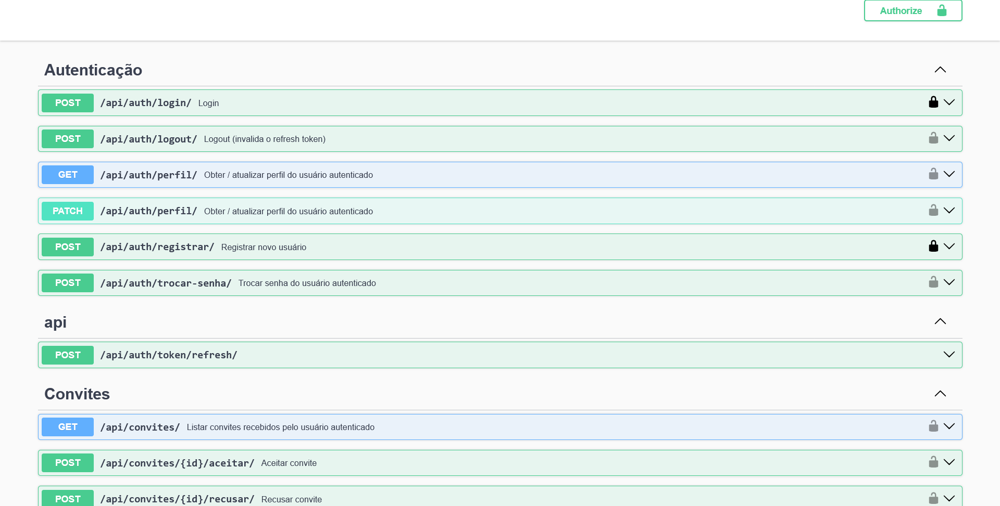
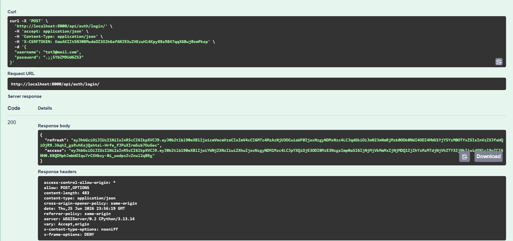
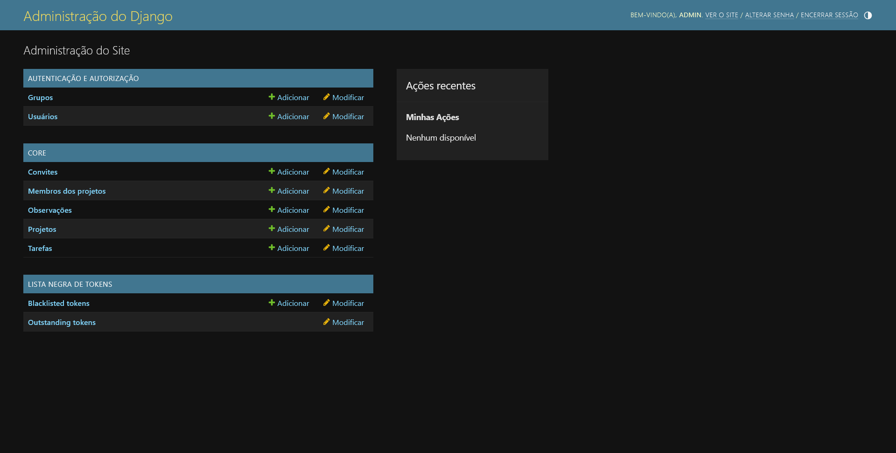

# Acadêmico — API Backend

**Autor:** Rafael Gama Vergilio

---

## Descrição do Projeto

**Acadêmico** é uma API REST construída com Django e Django REST Framework para gerenciamento de projetos acadêmicos colaborativos. Estudantes criam projetos, convidam colegas, atribuem tarefas e acompanham o andamento via observações.

---

### Tecnologias utilizadas
- Django 5.0.6
- Django REST Framework 3.15.2
- SimpleJWT 5.3.1
- drf-spectacular 0.27.2 Documentação Swagger/OpenAPI
- django-cors-headers 4.4.0 para as permissões CORS para o frontend
- WhiteNoise 6.7.0 Servir arquivos estáticos
- Gunicorn 22.0.0 Servidor WSGI para produção 
- Claude (auxílio no backend)
- DeepSeek (auxílio no front-end)
- Copilot (auxílio nos comentários e mensagens de commit)

---

### Escopo implementado

- Usuários e perfis: cada conta tem nome, sobrenome, matrícula e e-mail institucional.
- Projetos: criação, edição e exclusão de projetos com nome e descrição.
- Membros: o criador do projeto vira Líder automaticamente; outros entram como Membros via convite.
- Convites: líderes convidam por username; o convidado pode aceitar ou recusar.
- Tarefas: o líder cria tarefas com responsável, prazo e status (Pendente, Em andamento ou Concluída).
- Observações: qualquer membro pode comentar em tarefas. Mudanças de status geram uma observação automática com o nome de quem fez a alteração.
- Autenticação JWT: tokens de acesso com validade de 1 hora e refresh por 7 dias, com blacklist no logout.
- Swagger e ReDoc: documentação interativa em `/api/docs/` e `/api/redoc/`.
- Admin Django: painel de gerenciamento direto de todos os modelos.

---

## Telas







---

## Instalação Local

### Pré-requisitos

- Python 3.11 ou superior

### Passo a passo

```bash
git clone <URL_DO_REPOSITORIO_BACKEND>
cd backend_clean

# 2. Crie e ative o ambiente virtual
python -m venv venv
source venv/bin/activate        # Linux / macOS
venv\Scripts\activate           # Windows

pip install -r requirements.txt

# 4. Configure as variáveis de ambiente
cp .env.example .env
# Variáveis mínimas para rodar localmente:
#   SECRET_KEY=qualquer-string-longa-e-aleatoria
#   DEBUG=True
#   ALLOWED_HOSTS=localhost,127.0.0.1
#   CORS_ALLOW_ALL_ORIGINS=True

python manage.py migrate

python manage.py createsuperuser

python manage.py runserver
```

A API fica disponível em **http://localhost:8000/api/**.
O Swagger fica em **http://localhost:8000/api/docs/**.
O Admin fica em **http://localhost:8000/admin/**.

---

## Documentação da API (Swagger)

| Endereço | Descrição |
|---|---|
| `/api/docs/` | Swagger UI |
| `/api/redoc/` | ReDoc |
| `/api/schema/` | Schema OpenAPI em JSON |

### Como autenticar no Swagger

1. Faça `POST /api/auth/login/` com `username` e `password`.
2. Copie o valor de `access` retornado na resposta.
3. Clique em **Authorize** (canto superior direito) e informe `Bearer <seu_token>`.

---

## Endpoints Principais

### Autenticação

| Método | Rota | Descrição | Auth |
|---|---|---|---|
| `POST` | `/api/auth/registrar/` | Criar conta | Não |
| `POST` | `/api/auth/login/` | Login — retorna tokens JWT | Não |
| `POST` | `/api/auth/logout/` | Logout — invalida o refresh token | Sim |
| `GET / PATCH` | `/api/auth/perfil/` | Ver / editar perfil | Sim |
| `POST` | `/api/auth/trocar-senha/` | Trocar senha | Sim |
| `POST` | `/api/auth/token/refresh/` | Renovar access token | Não |

### Projetos

| Método | Rota | Descrição | Auth |
|---|---|---|---|
| `GET / POST` | `/api/projetos/` | Listar / criar projetos | Sim |
| `GET / PUT / DELETE` | `/api/projetos/{id}/` | Detalhar / editar / excluir | Sim |

### Membros

| Método | Rota | Descrição | Auth |
|---|---|---|---|
| `GET` | `/api/projetos/{id}/membros/` | Listar membros | Sim |
| `DELETE` | `/api/projetos/{id}/membros/{mid}/` | Remover membro (só Líder) | Sim |

### Convites

| Método | Rota | Descrição | Auth |
|---|---|---|---|
| `GET / POST` | `/api/projetos/{id}/convites/` | Listar / enviar convites | Sim |
| `GET` | `/api/convites/` | Meus convites recebidos | Sim |
| `POST` | `/api/convites/{id}/aceitar/` | Aceitar convite | Sim |
| `POST` | `/api/convites/{id}/recusar/` | Recusar convite | Sim |

### Tarefas

| Método | Rota | Descrição | Auth |
|---|---|---|---|
| `GET / POST` | `/api/projetos/{id}/tarefas/` | Listar / criar tarefas | Sim |
| `GET / PUT / PATCH / DELETE` | `/api/projetos/{id}/tarefas/{tid}/` | CRUD de tarefa | Sim |

### Observações

| Método | Rota | Descrição | Auth |
|---|---|---|---|
| `GET / POST` | `/api/projetos/{id}/tarefas/{tid}/observacoes/` | Listar / criar observações | Sim |
| `PATCH / DELETE` | `/api/projetos/{id}/tarefas/{tid}/observacoes/{oid}/` | Editar / excluir observação | Sim |

---

## Manual do Usuário / Administrador

### Fluxo típico de uso via API

1. **Registrar-se** com `POST /api/auth/registrar/` informando `username`, `email`, `password`, `nome`, `sobrenome` e `matricula`.
2. **Fazer login** em `POST /api/auth/login/` e guardar os tokens `access` e `refresh` retornados.
3. **Criar um projeto** via `POST /api/projetos/` — o criador vira Líder automaticamente.
4. **Convidar colegas** em `POST /api/projetos/{id}/convites/` informando o `username` do colega.
5. O colega **aceita** em `POST /api/convites/{id}/aceitar/`.
6. O líder **cria tarefas** em `POST /api/projetos/{id}/tarefas/` com `titulo`, `descricao`, `responsavel` e `prazo`.
7. Qualquer membro **atualiza o status** via `PATCH /api/projetos/{id}/tarefas/{tid}/` com o campo `status`.
8. Membros **comentam** em `POST /api/projetos/{id}/tarefas/{tid}/observacoes/` com o campo `texto`.

### Regras de permissão

| Ação | Quem pode |
|---|---|
| Criar / editar / excluir projeto | Líder |
| Remover membro do projeto | Líder |
| Enviar convites | Líder |
| Criar / excluir tarefas | Líder |
| Alterar status da tarefa | Qualquer membro |
| Editar título / descrição / prazo da tarefa | Líder |
| Criar observação | Qualquer membro |
| Editar / excluir observação | Autor da observação ou Líder |

### Renovação de token

O token `access` expira em 1 hora. Para renová-lo sem fazer login novamente:

```http
POST /api/auth/token/refresh/
Content-Type: application/json

{ "refresh": "<seu_refresh_token>" }
```

---

## O que funcionou

Autenticação completa: registro, login, logout com blacklist do refresh token e renovação automática do access token via `/api/auth/token/refresh/`. Troca de senha com validação da senha atual.

CRUD completo de Projetos, Tarefas e Observações com controle de papéis Líder/Membro aplicado em todos os endpoints sensíveis via permissões customizadas.

Sistema de convites: envio por username, aceitação, recusa e reenvio após recusa. Convite duplicado é bloqueado automaticamente.

Observação automática gerada ao alterar o status de uma tarefa, registrando quem fez a mudança e qual foi a transição.

Swagger UI e ReDoc ativos e documentando todos os endpoints. Admin Django com inlines de membros e tarefas. CORS configurado para aceitar requisições do frontend. Arquivos estáticos servidos via WhiteNoise.

---

## O que não funcionou

**Esqueci minha senha (reset por e-mail):** o fluxo de recuperação de senha não foi implementado. O endpoint `/api/auth/trocar-senha/` exige autenticação prévia, então um usuário que esqueceu a senha e não consegue entrar perde acesso. A solução alternativa é o administrador redefinir a senha diretamente pelo painel Admin.

---

**Link da API:**https://rafd.pythonanywhere.com/api/docs/
